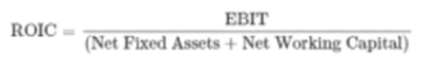
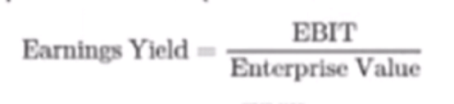
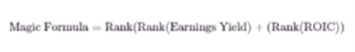
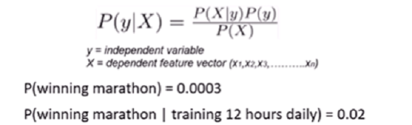
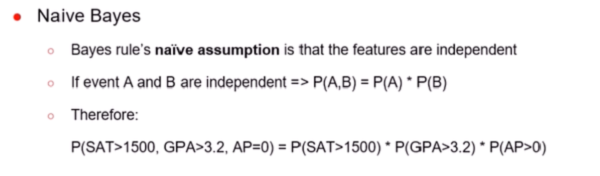
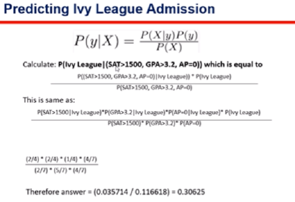
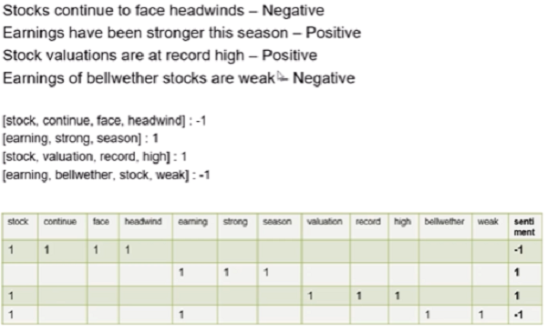
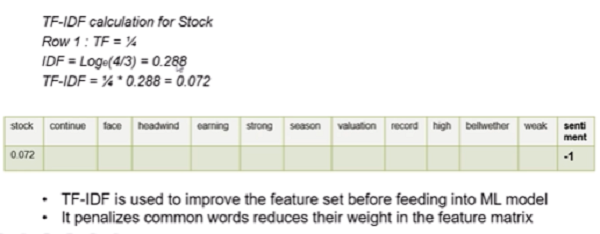

# Kinito.Finance
Kinito Finance Repository

## pip install

install -U arrow yfinance matplotlib Flask-Moment Delorean finviz pyarrow timeseries pandas-datareader Moments times moment

## Web Scrapping

Medium Artcile Link: https://medium.freecodecamp.org/how-to-scrape-websites-with-python-and-beautifulsoup-5946935d93fe

## MatPlotLib

https://pbpython.com/effective-matplotlib.html

Matplotlib Tutorial: https://matplotlib.org/tutorials/introductory/lifecycle.html

## Technical Indicators

### Moving Average Convergence Divergence - MACD (Lagging)

Many false positives on sideways market, to be used with others

Typical made by 3 periods:
- 12 Slow Moving Averga
- 26 Fast Moving Average
- 9 Signal

### Average True Rate & Bollinger Bands (Volatility)

Bollinger Bands made of N lines (2) from M periods (20) moving average line.
Delta is wide on high volatility & short during reduced volatility

ATR range perspective as swinging moves

### Relative Strenght Index - RSI

Momentum oscilation [0,100]
- [70,100] overbought (Emerging markets use 80)
- [0,30] oversold (Emerging markets use 80)


### Average Directional IndeX - ADX

Trend stength [0,100] comparing successive signal, then calculating the smoothed average of the difference of these
- [0,25]    abscent or weak
- [25,50]   strong
- [50,75]   very strong
- [75,100]  exteemely strong

### OBV (Leading)

Volume preceeding price movement. Higher OBV price increase, lower OBV price decrease.
False signals
Used with MACD


### Slope Charts - Supertrend

OLS aproximation on actual moving average trend

https://github.com/ChillarAnand/stocktrends

### Renko Charts

Timeseries data on price movement, filtering noise to see real trend.
Built on bricks. Time axis but not fix.
Closing price based calculation

```
pip install stocktrends
```

### TA-Lib Technical Analysis (C++) for Python 3.6 x32

TA-Lib website: http://ta-lib.org/

TA-Lib Python Wrapper Github Page: https://mrjbq7.github.io/ta-lib/

TA-Lib documentation of pattern recognition: https://mrjbq7.github.io/ta-lib/func_groups/pattern_recognition.html

Discussion on installation problems: https://github.com/mrjbq7/ta-lib/issues/127

Command to install TA-lib for python 3.5 and 3.6:

```
pip install -i https://pypi.anaconda.org/masdeseiscaracteres/simple ta-lib
```

Good website on chart patterns: http://thepatternsite.com

## Performance Measurements KPIs

### Compounded Annual Growth Rate - CAGR

Comparison of different trading strategies for asset or portfolio.
Does not reflect investment risk, use with volatility measure.


### Volatility Ratio

Standard deviation of the returns to capture variability of returns from the mean return. Annualization by multiplying volatility with aquare root of annualization factor:

- annualize daily volatility * sqrt(252) => 252 traiding days
- annualize weekly volatility * sqrrt(52) => 52 traiding weeks
- annualize monthly volatility * sqrt(12) => 12 traiding months

Used as risk measure assuming normal distribution of returns (false)
Does not capture tail risk.

### Sharpe Ratio

Average return earned in excess of the risk free rate per unit of volatility
Measure of risk adjusted return
Fails to dicern between upside and downside fluctuation
Used to compare funds
- [1,2] good
- [2,3] very good
- [3,more] excellent


### Sortino Ratio

Similar to Sharpe Ratio but uses standard deviation of only negative returns.
Used to dicern between upside and downside fluctuation => consider harmful volatility


### Maximum Drawdown Ratio

Largest percentage drop in asset price over a specified time period (peak distance difference)

### Calmar Ratio

Ratio of CAGR and Maximum Draw Down. Measure of risk adjusted return

## Strategies

First test your system/ strategy with a set of rules with trading signal mocking data with trading conditions
Factor in slippage (trading/ brokerage costs) when assessing performance.
Be conservative on side of caution

### Rebalancing - long term

Find a logical subset (L/ M/ S cap, industry, factor) specific and stick to this group.
Build fixed individual position sized long only portfolio by picking:
- M number of stocks based on monthly returns
- any other criteria

Rebalance every month replacing N worse stocks by top N stocks
Backtest it and compare the KPIs with that simple buy and hold strategy of corresponding index

### Intraday Resistance Breakout

Helps figure out when stock reach resistance (temporary historical top value - upper line)
Choose high volume, high activity stocks for this strategy (pre market movers, historically high volumes stocks)

Define breakout rule:
- use price breach 20 * period rolling max/ min price & vlume breaching rolling max volume (go long/ short stocks based on signals)

Define exit/ stop loss signal:
- use previous price +/- 20 * period ATR as the roling stop loss price

Calculate strategy cumulative return for each stock

### Intraday Renko Ratio - On Balance Volume

Pick high volume, high activity stock (pre market movers, historically high volumes stocks)

Define Buy Signal:
- Renko Ratio bar >= 2
- 5 day OBV Slope >= 30 degrees
- exit if Renko Ratio bar < 2

Define Sell Signal:
- Renko Ratio bar <= -2
- 5 day OBV Slope <= -30 degrees
- exit if Renko Ratio bar > -2

### Intraday Renko Ratio - MACD

Pick high volume, high activity stock (pre market movers, historically high volumes stocks)

Define Buy Signal:
- Renko Ratio bar >= 2
- MACD line >= signal line
- MACD line's slope (over 5 day period) >= signal line's slope (over the last 5 periods)
- exit if (MACD line < signal line) & (MACD line's slope < signal line's slope)

Define Sell Signal:
- Renko Ratio bar <= -2
- MACD line < signal line
- MACD line's slope (over 5 day period) < signal line's slope (over the last 5 periods)
- exit if (MACD line >= signal line) & (MACD line's slope >= signal line's slope)

## Value Investing - Fundamental Analysis

Price is what you pay, value is what you get.

Quantitative approach if you can afford computational power.
Quantitative methods:
- (Joel Greenblatt's) Magic Formula
- (Stanford Accounting Professor Joseph Piotroski) F-score

Excellent artcile on HFT based on actual events:

https://www.nytimes.com/2014/04/06/magazine/flash-boys-michael-lewis.html

### Magic Formula

Best seller ''The little book that beats the market'':
- identify *wonderfull stocks* at *bargain price*



*Wonderful stocks* : Return On Invested Capital (ROIC) focussing on assets generating the return



*Bargain price*: Earning Yield is the ratio of EBIT to Enterprise Value (like P/E ratio but capital structure independent)



Invest in the top 20-30 companies (exclude finance & insurance), accumulating 2-3 positions per month over 12 months period and rebalance each year.

### F-score (mid & small caps)

Number [0-9] which assess company's financial position strength, 9 bieng best. Pick sctock [8,9] and rebalance once or twice a year.

* profiltability criteria:
    - positive return on assets in the current year (1 point)
    - positive perating cash flow in the current year (1 point)
    - return on asset higher in the current year compared to previous year (1 point)
    - cash flow from operations divided by total assets greater than ROA in current year - Accruals - (1 point)
* leverage, liquidity & source of funds criteria:
    - lower ratio of long term debt in the current period, compared to previous - decreased leverage - (1 point)
    - higher current ratio this year compared to previous year, more liquidity (1 point)
    - no new shares were issued in the last year, lack of dilution (1 point)
* operating efficiency criteria:
    - higher gross margin compared to previous year (1 point)
    - higher asset turnover ratio compared to previous year (1 point)

## Trading System - building algorithmic automated

* direct access to stock exchange
  - high frequency
  - colocation
  - milliseconds downtime
* API trading
  - RESTful
  - similar to any broker
  - cheap
  - test performances
  - FXCM demo account https://www.fxcm.com/uk/forex-trading-demo/ u=D291103820 p=1504 token=49efa2a744bfcaa80119ebb7fd12ddb777ea2e70
* running code continiously/ periodically
  - crontab
  - taskmgr
  - Python 'timed' scripts

### Fxcm way

### Oanda way

API-Key 8f61d5ed3ce2f93b2cbc3d753abb6f82-e292f680364fc69b424f86fe2a817b3f

1. OANDA web trading terminal
https://trade.oanda.com/

2. OANDA Python wrapper installation
https://pypi.org/project/oandapyV20/

```
pip install oandapyV20
```

3. OANDA API (python wrapper) documentation
https://buildmedia.readthedocs.org/media/pdf/oanda-api-v20/latest/oanda-api-v20.pdf

4. OANDA developer account intro
http://developer.oanda.com/

#### SMA crosover

1. SMA Crossover Strategy Link
https://www.babypips.com/trading/forex-system-20150605

2. Stochastic
https://excellenceassured.com/trading/stochastic-oscillator-trading-indicator

## Cloud

Faster, reliable, try EC2 free on AWS
https://ca-central-1.console.aws.amazon.com/console/home?region=ca-central-1

i-05c31a451783d16d4
ec2-15-222-12-63.ca-central-1.compute.amazonaws.com

```
cd /path/to/PEMfile
chmod 400 udemy_demo.pem
chmod go-rwx filename.pem
chmod u-wx filename.pem
ssh -i "udemy_demo.pem" ec2-user@ec2-35-183-238-191.ca-central-1.compute.amazonaws.com
```

link to documentation on installing python and pip in your ec2 instance https://docs.aws.amazon.com/elasticbeanstalk/latest/dg/eb-cli3-install-linux.html

```
sudo yum install python37
curl -O https://bootstrap.pypa.io/get-pip.py
python3 get-pip.py --user
```

Basic introduction of crontab - https://www.thegeekstuff.com/2009/06/15-practical-crontab-examples/

sample crontab command to run you file every day at 9 am (monday to friday)

```
crontab -e
```

00 09 * * 1-5 /path/to/file

## Sentiment Analysis


### NLTK - Natural Language Processing

```
pip install -U nltk wordnet
```

### Lexicon based approach

Relies on underlyng sentiment, some manually constructed
- LIWC
- ANEW
- SentiWordNet
- SenticNet
- VADER

### VADER - Valence Aware Dictionary and sEntiment Reasoner

Inludes abbreviations and emoticons, Successfule in social media data. VADER [-4,4] Paper by Georgia Tech Computer Department: 
http://comp.social.gatech.edu/papers/icwsm14.vader.hutto.pdf

VADER Python library gitgub page:
https://github.com/cjhutto/vaderSentiment

```
pip install --upgrade vaderSentiment textblob
```

### Machine Learning approach on Natural Language

Probalility


Naive Bayes


Probability Prediction


#### Training Data (labeled data)

Constructing feature matrix


##### TF-IDF (Term Frequency - Inverse Document Frequency)

Algorithm assigning *weighting factor* to get important features of a document

TF: number of times the term t appear in the doc / total number of words in the doc

IDF: log(total number of documents/ number of documents with the term t in it)

TF-IDF: TF * IDF


### Application

Evolving area
Commercial product lexicon based therefore un accurate
Custom ML can be a product to sell
Challenges:
- label large volumes of news data accurately
- equities need industry specific classifiers
- streaming news expensive

```
export PATH=` echo $PATH | sed 's/:/\n/g' | grep -v mnt | xargs | sed 's/\ /\:/g' `
jupyter nbconvert --to script Section-17_98-WhatIsaNormalDistribution-Note.ipynb
```
