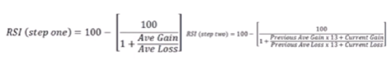
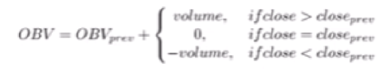
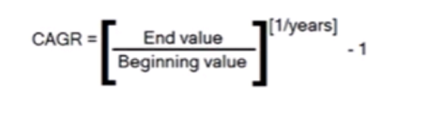
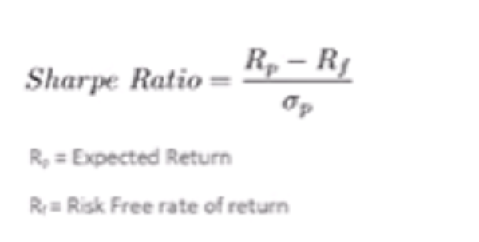
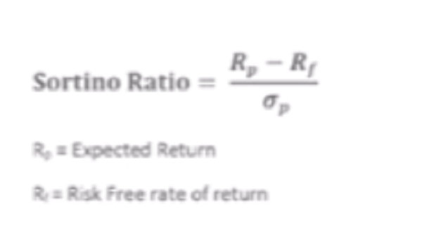

# Kinito.Finance
Kinito Finance Repository

## Web Scrapping

Medium Artcile Link: https://medium.freecodecamp.org/how-to-scrape-websites-with-python-and-beautifulsoup-5946935d93fe

## MatPlotLib

https://pbpython.com/effective-matplotlib.html

Matplotlib Tutorial: https://matplotlib.org/tutorials/introductory/lifecycle.html

## Technical Indicators

### Moving Average Convergence Divergence - MACD (Lagging)

Many false positives on sideways market, to be used with others

Typical made by 3 periods:
- 12 Slow Moving Averga
- 26 Fast Moving Average
- 9 Signal

### Average True Rate & Bollinger Bands (Volatility)

Bollinger Bands made of N lines (2) from M periods (20) moving average line.
Delta is wide on high volatility & short during reduced volatility

ATR range perspective as swinging moves

### Relative Strenght Index - RSI

Momentum oscilation [0,100]
- [70,100] overbought (Emerging markets use 80)
- [0,30] oversold (Emerging markets use 80)



### Average Directional IndeX - ADX

Trend stength [0,100] comparing successive signal, then calculating the smoothed average of the difference of these
- [0,25]    abscent or weak
- [25,50]   strong
- [50,75]   very strong
- [75,100]  exteemely strong

### OBV (Leading)

Volume preceeding price movement. Higher OBV price increase, lower OBV price decrease.
False signals
Used with MACD



### Slope Charts - Supertrend

OLS aproximation on actual moving average trend

https://github.com/ChillarAnand/stocktrends

### Renko Charts

Timeseries data on price movement, filtering noise to see real trend.
Built on bricks. Time axis but not fix.
Closing price based calculation

```
pip install stocktrends
```

### TA-Lib Technical Analysis (C++) for Python 3.6 x32

TA-Lib website: http://ta-lib.org/

TA-Lib Python Wrapper Github Page: https://mrjbq7.github.io/ta-lib/

TA-Lib documentation of pattern recognition: https://mrjbq7.github.io/ta-lib/func_groups/pattern_recognition.html

Discussion on installation problems: https://github.com/mrjbq7/ta-lib/issues/127

Command to install TA-lib for python 3.5 and 3.6:

```
pip install -i https://pypi.anaconda.org/masdeseiscaracteres/simple ta-lib
```

Good website on chart patterns: http://thepatternsite.com

## Performance Measurements KPIs

### Compounded Annual Growth Rate - CAGR

Comparison of different trading strategies for asset or portfolio.
Does not reflect investment risk, use with volatility measure.



### Volatility Ratio

Standard deviation of the returns to capture variability of returns from the mean return. Annualization by multiplying volatility with aquare root of annualization factor:

- annualize daily volatility * sqrt(252) => 252 traiding days
- annualize weekly volatility * sqrrt(52) => 52 traiding weeks
- annualize monthly volatility * sqrt(12) => 12 traiding months

Used as risk measure assuming normal distribution of returns (false)
Does not capture tail risk.

### Sharpe Ratio

Average return earned in excess of the risk free rate per unit of volatility
Measure of risk adjusted return
Fails to dicern between upside and downside fluctuation
Used to compare funds
- [1,2] good
- [2,3] very good
- [3,more] excellent



### Sortino Ratio

Similar to Sharpe Ratio but uses standard deviation of only negative returns.
Used to dicern between upside and downside fluctuation => consider harmful volatility



### Maximum Drawdown Ratio

Largest percentage drop in asset price over a specified time period (peak distance difference)

### Calmar Ratio

Ratio of CAGR and Maximum Draw Down. Measure of risk adjusted return

## Strategies

First test your system/ strategy with a set of rules with trading signal mocking data with trading conditions
Factor in slippage (trading/ brokerage costs) when assessing performance.
Be conservative on side of caution

### Rebalancing

### Resistance Breakout


## Value Investing

## Trading System

## Cloud

## Sentiment Analaysis
